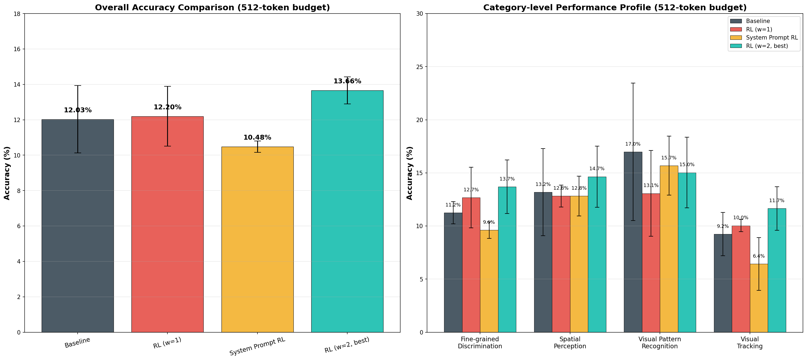

# BabyVision Experiments - Project Notes

> [!TIP]
> **📊 [Open the Interactive Results Dashboard](../index.html)**: charts, filterable tables, and logs.

## What this is

For my seminar, I've been experimenting on top of the [BabyVision benchmark](https://arxiv.org/pdf/2601.06521) - a visual reasoning benchmark of 388 puzzle-style tasks (things like finding the odd-one-out, solving mazes, folding paper, completing patterns). The original paper shows RL fine-tuning can improve a model's visual reasoning on this benchmark; my contribution is applying that same RL recipe to a model the paper didn't cover - **`google/gemma-4-E4B-it`** - and seeing whether the same approach helps there too.

I used `Qwen/Qwen2.5-7B-Instruct` as an LLM judge that grades whether the model's answer matches the ground truth. I also ran a couple of side comparisons: against a stock `Qwen/Qwen2.5-VL-7B-Instruct` (no training), and against ByteDance's `BAGEL-7B-MoT` (see [BAGEL_EVALUATION_REPORT.md](../BAGEL_EVALUATION_REPORT.md)).

This is a small-sample setup (388 tasks, 3 passes each) - good enough to get signal on what helps, not a rigorous claim about the state of the art.

## The story so far

**1. Baseline.** Ran stock Gemma with no training: **12.03% accuracy**.

**2. First RL attempt (GRPO, correctness reward weight = 1.0).** Only put LoRA adapters on the language-model layers. This landed at **12.20%**, basically flat against baseline.

**3. Second RL attempt (correctness reward weight = 2.0, multimodal LoRA).** Two changes: (a) extended the LoRA adapters to also cover the multimodal connector/projection layers, not just the language layers, and (b) doubled the weight on the correctness reward so formatting alone was no longer enough to score well. This got to **13.66% accuracy** - the best result, and a real improvement over baseline.

**4. Side experiment: system-prompt RL.** Instead of training the model to answer directly, I tried training it to *generate a system prompt* for itself, hoping it would learn to give itself better instructions. This landed at **10.48%**, below baseline - same underlying setup as attempt #2 minus the multimodal LoRA targets and the higher correctness weight.

**5. Caught a bug (the fun part).** My supervisor told me the RL results looked odd, which sent me digging. Turned out the evaluation script (`evaluate_local_hf.py`) was capping Gemma's generation at 256 tokens while every other model got 512, silently truncating a chunk of its answers before they ever reached `\boxed{...}`. Fixed by making the cap 512 for everyone and re-ran every variant.

## Results (512 tokens, token-cap bug fixed)

| Model | Accuracy |
| :--- | :---: |
| Baseline Gemma | 12.03% ± 1.90% |
| Gemma + RL (weight=1, language-only LoRA) | 12.20% ± 1.69% |
| Gemma + RL (weight=2, multimodal LoRA) | **13.66% ± 0.76%** - best |
| Gemma + system-prompt RL | 10.48% ± 0.32% |
| Qwen baseline (untrained) | 2.84% ± 0.21% - see note below |

**On the Qwen number:** it's not a fair comparison to the RL-tuned Gemma models above, since Qwen never went through any training - one model got extra help and the other didn't. The meaningful comparison for "which base model is stronger" is base Gemma (12.03%) vs. base Qwen (2.84%), same 512-token budget, no training on either side - and on that comparison, Gemma is clearly ahead here.

**Note on the weight=1 run:** at the old 256-token cap it looked like a real regression (9.54%, below the 11.08% baseline of that time). At 512 tokens it's roughly flat with baseline (12.20% vs 12.03%) - so a meaningful chunk of that original "regression" was the token-cap bug distorting the comparison, not the RL run itself being bad.

### By category

| Category | Baseline | RL (w=1) | RL (w=2) | System-prompt RL |
| :--- | :---: | :---: | :---: | :---: |
| Fine-grained Discrimination | 11.25% | 12.68% | 13.70% | 9.61% |
| Spatial Perception | 13.19% | 12.82% | 14.65% | 12.82% |
| Visual Pattern Recognition | 16.99% | 13.07% | 15.03% | 15.69% |
| Visual Tracking | 9.24% | 10.04% | 11.65% | 6.43% |

The best run's (weight=2) biggest gain was 3D Cube Unfold (2.78% baseline to 13.89%); its biggest regression was 3D Pattern Completion (35.19% baseline to 25.93%), which I haven't dug into yet.

Full per-task tables (all 388 tasks x 3 passes, what each model actually answered): [baseline](./baseline_maxtok512_detailed_results.md) / [RL w=1](./rl_correctness_weight1_maxtok512_detailed_results.md) / [RL w=2](./rl_correctness_weight2_maxtok512_detailed_results.md) / [system-prompt RL](./system_prompt_rl_maxtok512_detailed_results.md).

## What I'm doing next

1. Considering RL-training a Qwen variant too, so I can compare trained-vs-trained rather than trained-Gemma-vs-untrained-Qwen - this needs real adaptation work (Qwen's LoRA target modules and chat template differ from Gemma's), so only worth it if there's still something interesting to learn from it.
2. Double-checking whether the RL *training* rollouts (separate 256-token completion cap during GRPO, not the eval bug above) were also getting truncated - if so, the reward signal itself may have been noisy.
3. Digging into the 3D Pattern Completion regression under the weight=2 run, if there's time.

---

Job IDs and raw logs (for reproducibility)

| Run | Job ID | Logs |
| :--- | :---: | :---: |
| Baseline eval (256 tok, original) | `16875224` | [Out](../logs/evaluation/gemma_baseline_eval_16875224.out) / [Err](../logs/evaluation/gemma_baseline_eval_16875224.err) |
| RL training, w=1 | `16875257` | [Out](../logs/training/gemma_rl_v1_training_16875257.out) / [Err](../logs/training/gemma_rl_v1_training_16875257.err) |
| RL eval, w=1 (256 tok, original) | `16876673` | [Out](../logs/evaluation/gemma_rl_v1_eval_16876673.out) / [Err](../logs/evaluation/gemma_rl_v1_eval_16876673.err) |
| RL training, w=2 | `16877068` (resumed `16877168`) | [Out](../logs/training/gemma_rl_v2_training_16877068.out) / [Err](../logs/training/gemma_rl_v2_training_16877068.err) |
| RL eval, w=2 (256 tok, original) | `16877072` | [Out](../logs/evaluation/gemma_rl_v2_eval_16877072.out) / [Err](../logs/evaluation/gemma_rl_v2_eval_16877072.err) |
| System-prompt RL training | `16877070` | [Out](../logs/training/gemma_system_prompt_rl_training_16877070.out) / [Err](../logs/training/gemma_system_prompt_rl_training_16877070.err) |
| System-prompt RL eval (256 tok, original) | `16877197` | [Out](../logs/evaluation/gemma_system_prompt_rl_eval_16877197.out) / [Err](../logs/evaluation/gemma_system_prompt_rl_eval_16877197.err) |
| Baseline eval, 512 tokens | `23604080` | completed |
| RL eval, w=1, 512 tokens | `23657919` | completed |
| RL eval, w=2, 512 tokens | `23657920` | completed |
| System-prompt RL eval, 512 tokens | `23657921` | completed |
| Qwen baseline eval | *(archived, no job ID kept)* | - |

